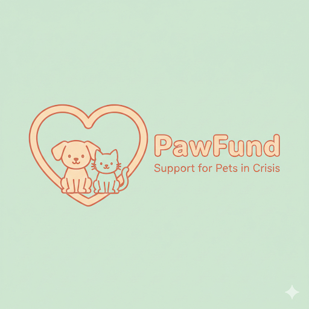
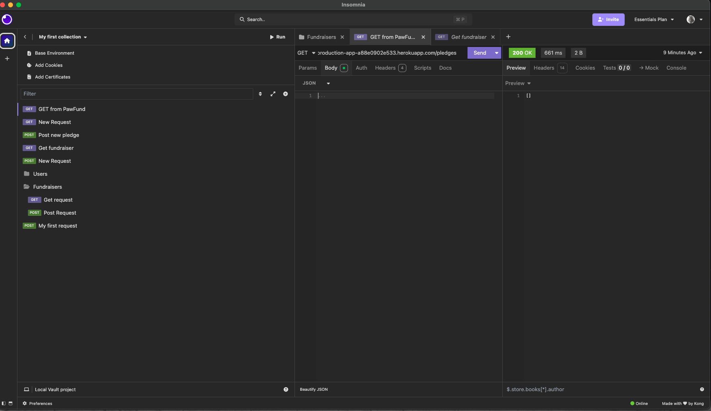
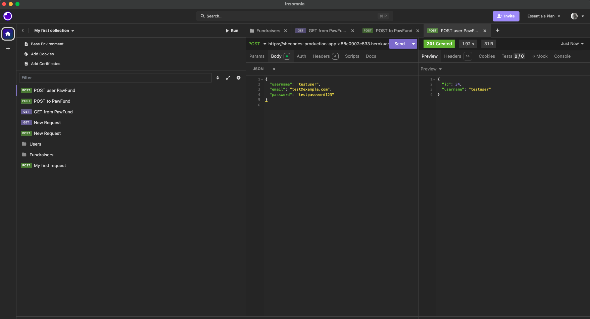
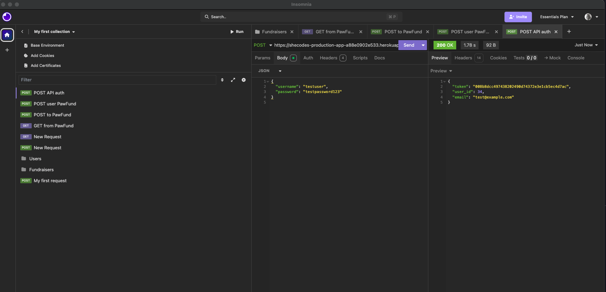
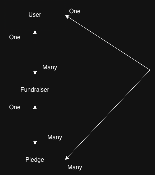

## PawFund — Crowdfunding Back End

### Olga Kozlovskaia

## Planning
### Concept / Name

**PawFund** is a community-driven crowdfunding platform that helps pets whose owners are facing crisis situations such as homelessness, domestic violence, or emergency relocation.
Many crisis shelters cannot accept animals, leaving vulnerable people with the heartbreaking choice of giving up their pets or delaying their own safety.

PawFund allows owners, support workers, and rescue groups to create verified fundraisers to cover **temporary boarding**, **emergency vet bills**, **foster care**, **rehabilitation**, or **rehoming support**.
Supporters can pledge anonymously or publicly to help keep pets safe and cared for during their owners’ hardest moments.

## Intended Audience / User Stories

#### Intended Audience

Individuals facing homelessness or crisis who need temporary support for their pets

Case workers and support agencies assisting people in crisis

Animal rescue groups and foster networks

Community members who want to help pets in need

Donors who prefer transparent, story-driven causes

#### User Stories

As a pet owner facing homelessness, I want to create a fundraiser so my pet can be safely boarded while I transition into housing.

As a support worker, I want to create or manage fundraisers on behalf of my clients to ensure their pets stay safe.

As a donor, I want to browse fundraisers and pledge anonymously or publicly.

As a fundraiser owner, I want to edit or update my fundraiser and close it when my goal is reached.

As a user, I want to register, log in, and see my account details securely.

## Front-End Pages / Functionality

#### Homepage

Displays list of open fundraisers

Search or filter fundraisers (e.g., by pet type, urgency)

View basic fundraiser details (title, goal, current amount, image)

#### Fundraiser Detail Page

Full fundraiser description and story

List of pledges (anonymous or named)

“Make a Pledge” form

Progress toward financial goal

Owner-only controls: edit, close fundraiser

#### Create Fundraiser Page

Form to submit title, description, goal, and optional image

Automatically assigns logged-in user as owner

#### User Profile Page

View personal account details

Shows list of fundraisers created by the user

Shows pledges made by the user

## Login / Signup Page

Endpoint:
POST /users/

Full URL:
shecodes-production-app-a88e0902e533.herokuapp.com/api-token-auth/

Request body (JSON):

{
  "username": "testuser",
  "email": "test@example.com",
  "password": "testpassword123"
}

#### Steps (Insomnia)
Create POST request to shecodes-production-app-a88e0902e533.herokuapp.com/api-token-auth/

Set Body → JSON and paste the JSON above.

Add header: Content-Type: application/json.

Send the request.

On success: 201 Created and a JSON representation of the user (without the password).

## Obtaining token

Endpoint:
POST /api-token-auth/

Request body (JSON):

{
  "username": "testuser",
  "password": "testpassword123"
}

#### Steps
Create POST request to shecodes-production-app-a88e0902e533.herokuapp.com/api-token-auth/.

Body → JSON with username + password.

Header: Content-Type: application/json.

Send the request.

Copy the token value from the response from the Authorization header.

## Creating a new fundraiser

Endpoint:
POST /fundraisers/

Request body (JSON):

{
  "title": "Emergency Boarding for Luna",
  "description": "Luna needs safe temporary boarding while her owner finds housing.",
  "goal": 500,
  "image": "https://example.com/luna.jpg",
  "is_open": true
}
Headers:

Content-Type: application/json

Authorization: Token YOUR_TOKEN_HERE

#### Steps (Insomnia)

Create POST request to shecodes-production-app-a88e0902e533.herokuapp.com/fundraisers/

Set Body → JSON and paste the fundraiser JSON.

Add Content-Type: application/json.

Add Authorization header with the token: Token abcdef123456...

Send the request.

On success: 201 Created and a JSON object representing the new fundraiser, with owner automatically set to the logged-in user.

## API Specification

| URL                  | HTTP Method | Purpose                                    | Request Body                                    | Success Response Code | Authentication           |
| -------------------- | ----------- | ------------------------------------------ | ----------------------------------------------- | --------------------- | ------------------------ |
| `/users/`            | POST        | Create a new user                          | `{ username, email, password }`                 | **201**               | Public                   |
| `/users/`            | GET         | List all users                             | None                                            | **200**               | Authenticated users only |
| `/users/<id>/`       | GET         | Get a single user                          | None                                            | **200**               | User must match ID       |
| `/api-token-auth/`   | POST        | Obtain authentication token                | `{ username, password }`                        | **200**               | Public                   |
| `/fundraisers/`      | GET         | List all fundraisers                       | None                                            | **200**               | Public                   |
| `/fundraisers/`      | POST        | Create a fundraiser                        | `{ title, description, goal, image?, is_open }` | **201**               | Authenticated            |
| `/fundraisers/<id>/` | GET         | Retrieve fundraiser detail (incl. pledges) | None                                            | **200**               | Public                   |
| `/fundraisers/<id>/` | PATCH       | Update fundraiser                          | Partial fields                                  | **200**               | Owner only               |
| `/fundraisers/<id>/` | DELETE      | Delete fundraiser                          | None                                            | **204**               | Owner only               |
| `/pledges/`          | GET         | List all pledges                           | None                                            | **200**               | Public                   |
| `/pledges/`          | POST        | Create pledge                              | `{ amount, comment, anonymous, fundraiser }`    | **201**               | Authenticated            |
| `/pledges/<id>/`     | GET         | Retrieve a pledge                          | None                                            | **200**               | Public                   |
| `/pledges/<id>/`     | PATCH       | Update pledge                              | Partial fields                                  | **200**               | Supporter only           |
| `/pledges/<id>/`     | DELETE      | Delete pledge                              | None                                            | **204**               | Supporter only           |

## Database Schema

### Custom User

| Field       | Type       | Notes                      |
| ----------- | ---------- | -------------------------- |
| id          | PK         | Auto-generated             |
| username    | CharField  | Required                   |
| email       | EmailField | Required                   |
| password    | CharField  | Hashed                     |
| permissions | Built-in   | Optional extra permissions |

### Fundraiser

| Field        | Type             | Notes                      |
| ------------ | ---------------- | -------------------------- |
| id           | PK               | Auto-generated             |
| title        | CharField        | Required                   |
| description  | TextField        | Required                   |
| goal         | IntegerField     | Required                   |
| image        | URLField         | Optional (`blank=True`)    |
| is_open      | BooleanField     | Open or closed             |
| date_created | DateTimeField    | `auto_now_add=True`        |
| owner        | ForeignKey(User) | Only owner may edit/delete |

### Pledge

| Field      | Type                   | Notes                        |
| ---------- | ---------------------- | ---------------------------- |
| id         | PK                     | Auto-generated               |
| amount     | IntegerField           | Required                     |
| comment    | CharField              | Optional                     |
| anonymous  | BooleanField           | If true, supporter not shown |
| fundraiser | ForeignKey(Fundraiser) | Many-to-one                  |
| supporter  | ForeignKey(User)       | Many-to-one                  |

